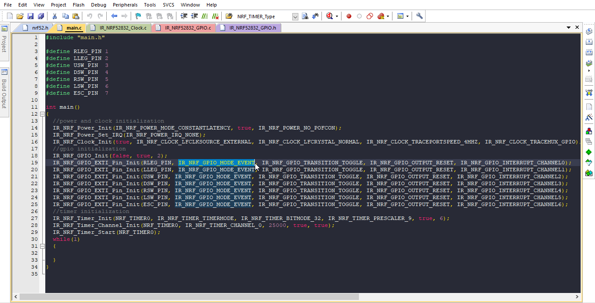

# Keil-theme
A dark theme for Keil v5 c/c++ editor

1. if you have a file named "global.prop" under "[installed drive]\Keil_v5\UV4", make a copy of it
2. copy the "global.prop" available in this repository to "[installed drive]\Keil_v5\UV4"
3. relaunch Keil
